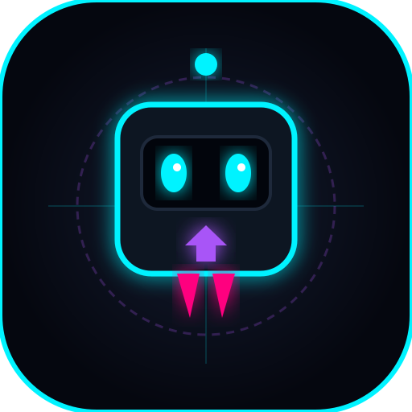

# 🌌 ASTRO GLITCH: QUANTUM HEIST ⚡🦸‍♂️

> An unfair, high-energy troll puzzle platformer inspired by troll physics, loaded with **8 Quantum & Superhero Abilities**, 16 handcrafted cyber-heist sectors, a procedural Web Audio synthesizer, and offline PWA support!



---

## 🎮 Play Live

- **Local Server**: Run `node server.js` and open `http://localhost:8085/`
- **PWA Ready**: Installable as a standalone desktop or mobile application directly from your browser!

---

## 🦸‍♂️ The 8 Quantum & Superhero Abilities

| Icon | Power | Keys | Description |
| :--- | :--- | :--- | :--- |
| ⚡ | **Phase Shift** | `Shift` / `1` | Phase through firewalls, lasers, drones, and plasma hazards. |
| ⏳ | **Chronos Slow** | `E` / `2` | Bullet-time slow motion (28% speed) to dodge falling traps. |
| 🚀 | **Polarity Invert** | `Q` / `F` / `3` | Reverse magnetic gravity to run on ceilings. |
| ⏪ | **Quantum Rewind** | `R` / `4` | Rewind position and state 2.5 seconds to undo fatal mistakes. |
| 🌌 | **Wormhole Warp** | `T` / `5` | Instant sub-space quantum leap across giant voids and asteroid pits. |
| 🔥 | **Heat Vision** | `Z` / `6` | Searing twin optic lasers: melt titanium blast barricades, vaporize sentries, and destroy fake troll doors from afar! |
| 🛡️ | **Aegis Shield** | `X` / `7` | Hexagonal hero forcefield that absorbs and deflects 1 fatal hazard (spikes, lasers, or enemy attacks). |
| 💥 | **Thunder Slam** | `C` / `V` / `8` | Hypersonic ground pound that shatters cracked floor decks and stuns nearby sentries! |

---

## 🗺️ 16 Hand-Crafted Cyber-Heist Sectors

1. **Sector 01: Protocol Alpha** *(Tutorial sector with Sentry-X patrol)*
2. **Sector 02: Desync Protocol** *(The Stargate teleports away as you reach it!)*
3. **Sector 03: Hydraulic Malfunction** *(Crushing plasma ceiling trap)*
4. **Sector 04: Anti-Gravity Chamber** *(Floor is pure anti-matter plasma, ceiling walk required)*
5. **Sector 05: Temporal Divergence** *(Decoy exit singularity & Quantum Phantasm)*
6. **Sector 06: Logic Inversion** *(Purple directional inverter field)*
7. **Sector 07: Traitor Circuit** *(Superpower bait — dash causes memory leak collapse)*
8. **Sector 08: Core Meltdown** *(Sentry-X & Quantum Phantasm coordinated ambush)*
9. **Sector 09: Orbital Void** *(Outer space void jumping on floating asteroids)*
10. **Sector 10: Event Horizon** *(Gravitational black hole dragging all matter)*
11. **Sector 11: Laser Array Grid** *(Solar beam grids & falling hyper-meteors)*
12. **Sector 12: Overclock Singularity** *(Rogue mainframe core confrontation)*
13. **Sector 13: Laser Sight Breach** *(Titanium blast barricades — melt them with Heat Vision!)*
14. **Sector 14: The Aegis Gauntlet** *(Rapid beam cannons & crushing spikes — pop Aegis Shield on impact!)*
15. **Sector 15: Hulk Seismic Vault** *(Lethal surface spikes — leap and Thunder Slam through the cracked deck!)*
16. **Sector 16: Superhero Assemble** *(Grand Finale: Chain Heat Vision, Aegis Shield, Thunder Slam & Wormhole!)*

---

## 🕹️ Controls

- **Move Left / Right**: `A` / `D` or `ArrowLeft` / `ArrowRight`
- **Jump / Thrusters**: `W` or `Space` or `ArrowUp`
- **Use Powers**: `1` through `8` or dedicated shortcut keys (`Shift`, `E`, `Q`, `R`, `T`, `Z`, `X`, `C`)
- **Mute / Unmute Audio**: `M`
- **Mobile Touch Controls**: Integrated responsive D-Pad and 8 power action buttons for touch devices.

---

## 🚀 How to Run Locally

```bash
# Clone the repository
git clone <YOUR_REPO_URL>
cd astro-glitch

# Run the lightweight Node.js server
node server.js
```

Open `http://localhost:8085` in any modern web browser!

---

## 🌐 Deploy to Web (100% Static & Free)

This project has zero external dependencies or build tools. You can deploy it instantly:
- **GitHub Pages**: Go to Repository Settings -> Pages -> Deploy from Branch (`main` / root).
- **Vercel**: `vercel deploy`
- **Netlify**: Drag and drop the folder or connect your GitHub repository.

---

## 📜 License
MIT License. Built with HTML5 Canvas & Web Audio API.
